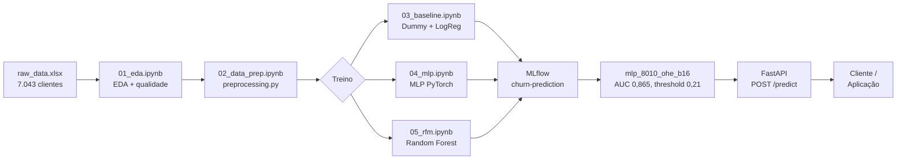

<div align="center">

# Churn Prediction - Telco Customer Churn

Pipeline end-to-end para previsão de churn em telecomunicações

[Resultados](#resultados) | [Pipeline](#pipeline) | [Instalação](#instalação) | [Notebooks](#notebooks) | [API](#api-de-inferência) | [Roadmap](#roadmap) | [Contato](#contato)

Ferramentas:


Detalhes:


</div>

## Sobre o Projeto

Projeto desenvolvido para o **Tech Challenge, Fase 01** da pós-graduação em
Machine Learning Engineering (FIAP MLET).

Uma operadora de telecomunicações está perdendo clientes em ritmo acelerado.
O objetivo é classificar o risco de cancelamento de cada cliente em 3 categorias (baixo, médio, alto) para permitir ações de retenção proativas.

## Dataset

O dataset utilizado é o **Telco Customer Churn (IBM)**, com 7.043 clientes e 33 colunas, que caracterizam features pessoais, geográficas, contratuais e consumo. A variável alvo é `Churn` (Yes/No), com  ~26,5% de churn.

> O arquivo bruto está versionado em [data/raw/raw_data.xlsx](data/raw/raw_data.xlsx)
>
> O dicionário completo de colunas está disponível em [docs/data_description.md](docs/data_description.md).

## Análise de Custo

Nossa análise de custo estipula que cada Falso Negativo custa ~10x mais que cada Falso Positivo, incentivando modelos que priorizem recall mesmo à custa de precisão.

> Nossa análise de custo detalhada está disponível em seus respectivos modelos, [notebooks/04_mlp.ipynb](notebooks/04_mlp.ipynb) e [notebooks/05_rfm.ipynb](notebooks/05_rfm.ipynb), na seção "Análise de Custo por Threshold".

## Reprodutibilidade

A reprodutibilidade é garantida em todos os modelos, numpy, scikit-learn e PyTorch (CPU e CUDA) graças à Seed fixa 42.

> `SEED = 42` definida em [src/churn/config.py](src/churn/config.py) e verificável em `02_data_prep.ipynb`.

## Resultados

Modelo de produção: **`mlp_8010_ohe_b16`**, com threshold de deploy **0,21**
(minimiza custo total no val holdout: −26,7% vs. threshold padrão 0,50, −83% vs. nenhuma ação).

---

<div align="center">

### Val holdout: threshold 0,50 (comparação padrão)

| Modelo | Accuracy | Precision | Recall | F1 | ROC AUC | PR AUC |
|---|---|---|---|---|---|---|
| `logreg_nophone_noml_8010_le` | 0,786 | 0,566 | 0,829 | 0,672 | **0,873** | 0,697 |
| **`mlp_8010_ohe_b16`** | 0,783 | 0,560 | **0,845** | **0,674** | 0,870 | **0,691** |

---

### Val holdout: threshold 0,21 (deploy — custo mínimo)

| Modelo | Accuracy | Precision | Recall | F1 | ROC AUC | PR AUC |
|---|---|---|---|---|---|---|
| `logreg_nophone_noml_8010_le` | 0,651 | 0,427 | 0,911 | 0,581 | **0,873** | 0,697 |
| **`mlp_8010_ohe_b16`** | 0,658 | 0,435 | **0,963** | 0,599 | 0,870 | **0,691** |

</div><br>

> Um modelo generalista, com:
> - <b>precisão</b> <i>Baixa</i>
> - <b>acurácia</b>, e <b>pr-auc</b> <i>Moderados</i>
> - <b>recall</b> e <b>roc-auc</b> <i>Altos</i>
>
> Isso destaca um modelo generalista, eficaz em identificar clientes que realmente vão cancelar e com boa capacidade de discriminação geral, mas com baixa precisão, ou seja, muitos falsos positivos.

### O que o modelo aprendeu — impacto de cada feature

> Coeficientes vindos do modelo de Regressão Logística, e serve como base para a interpretação.
> 
> - **Positivo = Churn**. 
> - **Negativo = Retencao.** 
> 
> Dentro de cada feature, valores ordenados do maior para o menor impacto.

<details>

<summary><b>Pessoal</b></summary>

| Feature | Value | Impact |
|---|---|---|
| Gender | Feminino | `+0.03` |
|  | Masculino | `-0.03` |
| | | |
| Senior Citizen | Sim | `+0.07` |
|  | Nao | `-0.07` |
| | | |
| Partner | Sim | `+0.29` |
|  | Nao | `-0.29` |
| | | |
| Dependents | Nao | `+1.53` |
|  | Sim | `-1.53` |

</details><br>

<details>
<summary><b>Serviços</b></summary>

| Feature | Value | Impact |
|---|---|---|
| Internet Service | Fibra optica | `+1.03` |
|  | DSL | `-0.08` |
|  | Sem internet | `-1.18` |
| | | |
| Online Security | Nao | `+0.58` |
|  | Sim | `-0.58` |
| | | |
| Tech Support | Nao | `+0.61` |
|  | Sim | `-0.61` |
| | | |
| Online Backup | Nao | `+0.36` |
|  | Sim | `-0.36` |
| | | |
| Device Protection | Nao | `+0.32` |
|  | Sim | `-0.32` |
| | | |
| Streaming TV | Sim | `+0.06` |
|  | Nao | `-0.06` |
| | | |
| Streaming Movies | Sim | `+0.06` |
|  | Nao | `-0.06` |

</details><br>

<details>
<summary><b>Contratuais</b></summary>

| Feature | Value | Impact |
|---|---|---|
| Contract | Month-to-month | `+0.09` |
|  | One year | `-0.03` |
|  | Two year | `-0.30` |
| | | |
| Paperless Billing | Sim | `+0.34` |
|  | Nao | `-0.34` |
| | | |
| Payment Method | Electronic check | `+0.20` |
|  | Bank transfer (automatic) | `-0.10` |
|  | Credit card (automatic) | `-0.16` |
|  | Mailed check | `-0.18` |
| | | |
| Tenure Months | Curto | `+0.70` |
|  | Longo | `-0.70` |
| | | |
| Monthly Charges | Baixa | `+0.67` |
|  | Alta | `-0.67` |
| | | |
| Total Charges | Alto | `+0.39` |
|  | Baixo | `-0.39` |
| | | |
| CLTV | Baixo | `+0.01` |
|  | Alto | `-0.01` |
| | | |

</details><br>

> ¹ Features engineered internas (service_count, risco_contrato, charges_per_tenure, tenure bins) omitidas por serem derivadas das colunas acima.

> ²  Esses valores são específicos do modelo de Regressão Logística, e não necessariamente refletem a importância real das features no modelo final de MLP, que é mais complexo e pode capturar interações não lineares.

## Pipeline



## Stack

<div align="center">

| Camada | Tecnologia | Papel |
|---|---|---|
| Dados | Pandas + openpyxl | Leitura, limpeza e feature engineering |
| Pré-processamento | scikit-learn ColumnTransformer | Scaling, OneHot, pipeline reprodutível |
| Modelo principal | PyTorch 2.x | MLP com BatchNorm, Dropout e early stopping |
| Modelos baseline | scikit-learn | DummyClassifier, LogisticRegression, RandomForest |
| Tracking | MLflow 2.x | Parâmetros, métricas e artefatos por run |
| API | FastAPI + Uvicorn | Endpoint `/predict` com validação Pydantic v2 |
| Testes | pytest + pytest-cov | 69 testes, 88% de cobertura |
| Linting | ruff | Zero erros em `src/` e `tests/` |
| Notebooks | JupyterLab | EDA, treino, análise de custo e bias |

</div>

## Instalação

```bash
# 1. Clonar o repositório
git clone https://github.com/NycolasGarcia/Churn-Prediction-ANN.git
cd Churn-Prediction-ANN

# 2. Criar e ativar o ambiente virtual
python -m venv .venv

    # Windows- Git Bash / WSL
    source .venv/Scripts/activate

    # Windows- PowerShell / cmd
    .venv\Scripts\activate

# 3. Instalar o projeto em modo editável com extras de desenvolvimento
pip install -e ".[dev]"
```

> O dataset (`data/raw/raw_data.xlsx`) e o modelo treinado (`models/mlp_deploy.pt`,
> `models/preprocessor_deploy.joblib`) já estão versionados, sem necessidade de download
> ou treino adicional para rodar a API.


## Quick Start

```bash
# Abrir os notebooks (EDA, treino, análise)
jupyter lab notebooks/

# Treinar os modelos e registrar no MLflow
make train-baseline   # Dummy + LogReg
make train-mlp        # MLP PyTorch

# Visualizar experimentos no MLflow UI
make mlflow-ui        # → http://localhost:5000

# Subir a API de inferência
make run              # → http://localhost:8000/docs

# Rodar testes com cobertura
make test

# Verificar linting
make lint
```

## Makefile

<div align="center">

| Comando | O que faz |
|---|---|
| `make install` | Instala deps + projeto em modo editável |
| `make lint` | `ruff check src/ tests/` |
| `make format` | `ruff format src/ tests/` |
| `make test` | Suite pytest com cobertura |
| `make train-baseline` | Treina Dummy + LogReg, loga no MLflow |
| `make train-mlp` | Treina MLP em PyTorch |
| `make mlflow-ui` | MLflow UI em `localhost:5000` |
| `make run` | API FastAPI em `localhost:8000` |

</div>

## Documentação

<div align="center">

| Documento | Conteúdo |
|---|---|
| [MODEL_CARD.md](MODEL_CARD.md) | Model Card: métricas, limitações, análise de viés por subgrupo |
| [docs/ml_canvas.md](docs/ml_canvas.md) | ML Canvas: proposta de valor, stakeholders, métricas, SLOs |
| [docs/architecture.md](docs/architecture.md) | Architecture Decision Records: ADR-001 a ADR-010 |
| [docs/monitoring_plan.md](docs/monitoring_plan.md) | Plano de monitoramento: sinais, alertas, retreino, fairness |
| [docs/data_description.md](docs/data_description.md) | Dicionário completo das colunas do dataset |

</div>

## Notebooks

<div align="center">

| Notebook | Conteúdo |
|---|---|
| [01_eda.ipynb](notebooks/01_eda.ipynb) | Análise exploratória: qualidade, distribuições, correlações, churn por segmento |
| [02_data_prep.ipynb](notebooks/02_data_prep.ipynb) | Pré-processamento: cleaning, feature engineering, split 80/10/10, exportação |
| [03_baseline.ipynb](notebooks/03_baseline.ipynb) | Baselines com CV 5-fold, tracking MLflow, ablation 2×2 e análise de threshold |
| [04_mlp.ipynb](notebooks/04_mlp.ipynb) | MLP PyTorch: arquitetura, 21 runs, análise de custo por threshold, blind test |
| [05_rfm.ipynb](notebooks/05_rfm.ipynb) | Random Forest: ablação de FE, busca estendida `n_iter=50`, comparativo final |
| [06_bias_analysis.ipynb](notebooks/06_bias_analysis.ipynb) | Análise de viés: ROC-AUC, F1 e FNR por gênero, sênior e faixas de tenure |

</div>


## API de Inferência

O modelo treinado foi empacotado em uma **API REST com FastAPI**:

A API carrega o modelo na inicialização a partir dos artefatos versionados em
`models/`, e funciona em qualquer clone sem precisar rodar os notebooks de treino.
Se o MLflow local estiver disponível (após rodar `04_mlp.ipynb`), ele é usado
como fonte primária; `models/` é o fallback.

<div align="center">

| Método | Path | Descrição |
|---|---|---|
| `GET` | `/health` | Liveness check: status e versão do modelo |
| `POST` | `/predict` | Recebe features de um cliente, retorna probabilidade e nível de risco |
| `GET` | `/docs` | Swagger UI interativo (gerado automaticamente pelo FastAPI) |

</div>

A cobertura de qualidade inclui:
- **69 testes automatizados** passando (smoke, schema, API)
- **85% de cobertura de código** com pytest-cov
- `ruff check` passando **sem erros**, com linting estrito e linha máxima de 88 caracteres
- P95 < 100ms de latência por predição
- Plano de monitoramento documentado com alertas para data drift (PSI), prediction drift e ROC-AUC rolling
- Política de retreino trimestral ou sob alerta de drift

**Testando via Swagger UI:** suba a API com `make run`, abra `http://localhost:8000/docs`,
expanda `POST /predict`, clique em **Try it out** e cole um dos payloads abaixo.

<details>
<summary><strong>Cliente de alto risco</strong>, contrato mensal, fibra, 2 meses de tenure → <code>"risk_level": "high"</code></summary>

```json
{
  "gender": "Female",
  "senior_citizen": "No",
  "partner": "No",
  "dependents": "No",
  "tenure_months": 2,
  "phone_service": "Yes",
  "multiple_lines": "No",
  "internet_service": "Fiber optic",
  "online_security": "No",
  "online_backup": "No",
  "device_protection": "No",
  "tech_support": "No",
  "streaming_tv": "Yes",
  "streaming_movies": "Yes",
  "contract": "Month-to-month",
  "paperless_billing": "Yes",
  "payment_method": "Electronic check",
  "monthly_charges": 85.5,
  "total_charges": 171.0,
  "cltv": 3200
}
```

</details>

<details>
<summary><strong>Cliente de baixo risco</strong>, contrato bienal, DSL, 58 meses de tenure → <code>"risk_level": "low"</code></summary>

```json
{
  "gender": "Male",
  "senior_citizen": "No",
  "partner": "Yes",
  "dependents": "Yes",
  "tenure_months": 58,
  "phone_service": "Yes",
  "multiple_lines": "Yes",
  "internet_service": "DSL",
  "online_security": "Yes",
  "online_backup": "Yes",
  "device_protection": "Yes",
  "tech_support": "Yes",
  "streaming_tv": "No",
  "streaming_movies": "No",
  "contract": "Two year",
  "paperless_billing": "No",
  "payment_method": "Bank transfer (automatic)",
  "monthly_charges": 72.0,
  "total_charges": 4176.0,
  "cltv": 5800
}
```

</details>

## Estrutura do Projeto

```
churn-prediction/
├── data/
│   ├── raw/                # raw_data.xlsx versionado (~1,3 MB)
│   └── processed/          # splits + preprocessor (gitignored)
├── models/
│   ├── mlp_deploy.pt       # state_dict do modelo de produção (~22 KB)
│   ├── preprocessor_deploy.joblib  # pipeline sklearn serializado (~8 KB)
│   └── config.json         # hiperparâmetros e threshold para reconstrução
├── docs/                   # canvas, ADRs, plano de monitoramento, dicionário
├── notebooks/              # 01_eda … 06_bias_analysis (outputs salvos)
├── src/churn/              # pacote Python instalável
│   ├── config.py           # SEED, paths, custos, constantes do projeto
│   ├── data/               # loader.py + preprocessing.py
│   ├── models/             # baseline.py (LogReg/Dummy) + mlp.py (PyTorch)
│   ├── training/           # trainer.py + evaluate.py + tracking.py
│   └── api/                # FastAPI — main.py, schemas.py, middleware.py
├── tests/                  # pytest suite (69 testes, 88% cobertura)
├── pyproject.toml          # deps, ruff, pytest — single source of truth
└── Makefile                # install / lint / test / run / train / mlflow-ui
```


## Roadmap
- [x] **Fase 1  Setup e EDA**
  - [x] Estrutura de pastas, `pyproject.toml` e `Makefile`
  - [x] Dataset IBM Telco versionado em `data/raw/` (sem download extra)
  - [x] EDA completa (`01_eda.ipynb`) distribuições, correlações e churn por segmento
  - [x] Pipeline de pré-processamento (`02_data_prep.ipynb`) feature engineering, split 80/10/10 estratificado
- [x] **Fase 2 Baselines**
  - [x] `DummyClassifier` e `LogisticRegression` com `class_weight='balanced'`
  - [x] `ColumnTransformer` com `StandardScaler` + `OneHotEncoder`
  - [x] CV estratificada 5-fold com tracking MLflow completo
  - [x] Ablation 2×2 (`Phone Service` × `Multiple Lines`) variantes estatisticamente indistinguíveis
  - [x] `03_baseline.ipynb` com métricas em dois thresholds (0,50 e 0,21)
- [x] **Fase 3 MLP PyTorch e Random Forest**
  - [x] Arquitetura MLP com `BatchNorm`, `Dropout` e early stopping (patience=10)
  - [x] Bateria de 21 runs ablação de FE (`orig`/`le`/`ohe`) e split (70/15/15 vs 80/10/10)
  - [x] Análise de custo por threshold (FP=R$50 / FN=R$500) ótimo: **0,21**
  - [x] Random Forest com busca estendida `n_iter=50` confirma `max_depth=10` como ótimo genuíno
  - [x] Comparativo final: MLP AUC **0,865** vs RF 0,861 no blind test
- [x] **Fase 4 API e Testes**
  - [x] FastAPI com `/predict`, `/health` e Swagger UI em `/docs`
  - [x] Validação de entrada via Pydantic v2; middleware de latência estruturado
  - [x] 69 testes pytest (smoke, schema, API) com 88% de cobertura
  - [x] `ruff check src/ tests/` sem erros
- [x] **Fase 5 Documentação e Model Card**
  - [x] `06_bias_analysis.ipynb` ROC-AUC, F1 e FNR por gênero, sênior e tenure
  - [x] Model Card com análise de viés (sênior: AUC 0,778; tenure 37–60m: FNR 17%)
  - [x] ADR-001 superseded por ADR-009; ADR-009 e ADR-010 documentados formalmente
  - [x] Plano de monitoramento atualizado com subgrupos prioritários de fairness

## Contato

<div align="center">

| Plataforma | Link |
|---|---|
|  | [LinkedIn](https://www.linkedin.com/in/NycolasAGRGarcia/) |
|  | [GitHub](https://github.com/NycolasGarcia) |
|  | [Gmail](mailto:nycolasagrg.work@gmail.com) |
|  | [Portfólio](https://dev-nycolas-garcia.vercel.app/) |

</div>
